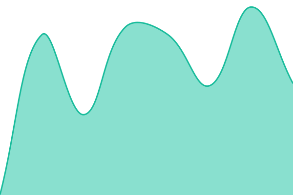
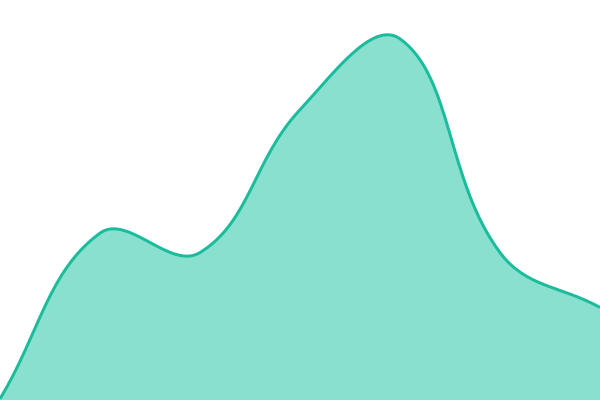
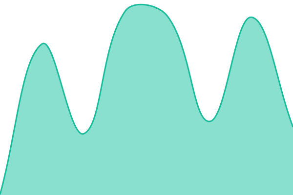

# [📈 Live Status](https://XsopGroup.github.io/status): <!--live status--> **🟩 All systems operational**

This repository contains the open-source uptime monitor and status page for [XsopGroup](https://XsopGroup.github.io/status), powered by [Upptime](https://github.com/upptime/upptime).

With [Upptime](https://upptime.js.org), you can get your own unlimited and free uptime monitor and status page, powered entirely by a GitHub repository. We use [Issues](https://github.com/XsopGroup/status/issues) as incident reports, [Actions](https://github.com/XsopGroup/status/actions) as uptime monitors, and [Pages](https://XsopGroup.github.io/status) for the status page.

<!--start: status pages-->
<!-- This summary is generated by Upptime (https://github.com/upptime/upptime) -->
<!-- Do not edit this manually, your changes will be overwritten -->
<!-- prettier-ignore -->
| URL | Status | History | Response Time | Uptime |
| --- | ------ | ------- | ------------- | ------ |
|  [秀操作](https://www.xsop.de) | 🟩 Up | [秀操作.yml](https://github.com/XsopGroup/status/commits/HEAD/history/秀操作.yml) | 

 618ms
     
 | 

<a href="https://XsopGroup.github.io/status/history/秀操作">100.00%</a>
    

|  [IPShow](https://ipshow.de) | 🟩 Up | [ip-show.yml](https://github.com/XsopGroup/status/commits/HEAD/history/ip-show.yml) | 

 227ms
     
 | 

<a href="https://XsopGroup.github.io/status/history/ip-show">100.00%</a>
    

|  [Cloudfare Bond](https://cloudfare.bond) | 🟩 Up | [cloudfare-bond.yml](https://github.com/XsopGroup/status/commits/HEAD/history/cloudfare-bond.yml) | 

 471ms
     
 | 

<a href="https://XsopGroup.github.io/status/history/cloudfare-bond">100.00%</a>
    

|  [BestIP](https://bestip.bond) | 🟩 Up | [best-ip.yml](https://github.com/XsopGroup/status/commits/HEAD/history/best-ip.yml) | 

 175ms
     
 | 

<a href="https://XsopGroup.github.io/status/history/best-ip">100.00%</a>
    

|  [127001 Bond](https://127001.bond) | 🟩 Up | [127001-bond.yml](https://github.com/XsopGroup/status/commits/HEAD/history/127001-bond.yml) | 

 240ms
     
 | 

<a href="https://XsopGroup.github.io/status/history/127001-bond">100.00%</a>
    

<!--end: status pages-->

[**Visit our status website →**](https://XsopGroup.github.io/status)

## 📄 License

- Powered by: [Upptime](https://github.com/upptime/upptime)
- Code: [MIT](./LICENSE) © [Anand Chowdhary](https://anandchowdhary.com)
- Data in the `./history` directory: [Open Database License](https://opendatacommons.org/licenses/odbl/1-0/)
